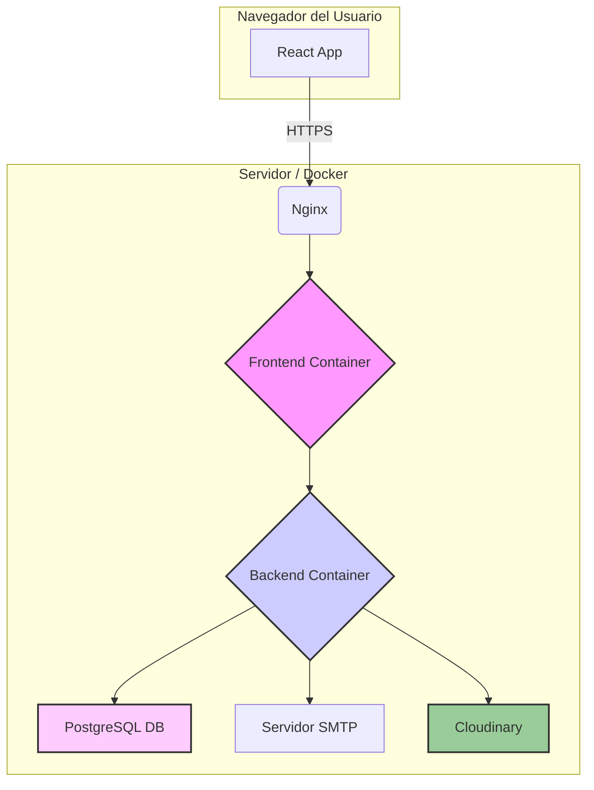

# PetMatch - Encuentra la Pareja Perfecta para tu Mascota

PetMatch es una aplicación web moderna, de alto rendimiento y segura, diseñada para que los dueños de mascotas puedan encontrar la pareja ideal para sus compañeros peludos.

## Diagrama de Arquitectura

El proyecto está completamente contenedorizado con Docker, asegurando un entorno de desarrollo y despliegue consistente y aislado.



## Características Principales

-   **Perfiles Detallados:** Creación de perfiles para usuarios y sus mascotas, con soporte para **múltiples fotos**.
-   **Sistema de "Swipe" y Galería:** Interfaz intuitiva para descubrir mascotas y ver sus perfiles y galerías de fotos.
-   **Chat Funcional:** Comunicación segura entre dueños una vez que se produce un "Match".
-   **Panel de Administración Avanzado:**
    -   Gestión de usuarios y mascotas.
    -   **Dashboard de Estadísticas:** Gráficos que muestran el crecimiento de usuarios.
    -   **Visor de Logs de Errores:** Acceso directo a los logs de errores del backend para un diagnóstico rápido.

### Características Técnicas y de Seguridad

-   **Autenticación Segura con Cookies `HttpOnly`:** Mitiga el riesgo de ataques XSS al no usar `localStorage` para los tokens.
-   **Subida de Archivos a la Nube:** Integración con **Cloudinary** para un almacenamiento de imágenes eficiente y escalable.
-   **Manejo de Excepciones Global:** Un `@RestControllerAdvice` centraliza el manejo de errores, proporcionando respuestas de error consistentes y seguras.
-   **Logging Avanzado:** Configuración de **Logback** para separar los logs de errores en un archivo dedicado (`ErroresPetmatchBack.log`).
-   **Validación de Datos de Entrada:** Previene inyecciones de datos maliciosos y asegura la integridad de la base de datos.
-   **Protección contra Inyección SQL:** Uso de JPA y consultas parametrizadas.
-   **Rendimiento Optimizado (Code Splitting):** El código del panel de administración se carga de forma perezosa.
-   **Experiencia de Usuario Mejorada (UX):** Indicadores de carga, notificaciones "toast" y un diseño responsivo.

---

## Resumen de la API del Backend

La API sigue una arquitectura RESTful y está protegida por Spring Security.

#### Autenticación (`/api/auth`)
-   `POST /register`: Registra un nuevo usuario.
-   `POST /login`: Autentica a un usuario y establece una cookie `HttpOnly` de sesión.
-   `POST /logout`: Invalida la cookie de sesión.
-   `GET /me`: Devuelve los datos del usuario autenticado actualmente.
-   `POST /forgot-password` y `POST /reset-password`: Flujo de recuperación de contraseña.

#### Mascotas (`/api/pets`)
-   `POST /`: Crea un nuevo perfil de mascota.
-   `PUT /{id}`: Actualiza una mascota existente.
-   `GET /{id}`: Obtiene los detalles de una mascota.
-   `GET /owner/{ownerId}`: Obtiene todas las mascotas de un propietario.
-   `POST /{petId}/photos`: **Sube una foto** para una mascota y la asocia a su galería.

#### Feed y Swipes (`/api/feed`, `/api/swipes`)
-   `GET /feed`: Obtiene una lista paginada de mascotas para deslizar.
-   `POST /swipes`: Registra un "like" o "dislike".

#### Matches y Chat (`/api/matches`, `/api/messages`)
-   `GET /matches`: Devuelve la lista de matches del usuario autenticado.
-   `GET /messages/match/{matchId}`: Obtiene el historial de chat de un match.
-   `POST /messages`: Envía un nuevo mensaje a un match.

#### Administración (`/api/admin`)
-   `GET /users`: Obtiene una lista de todos los usuarios.
-   `GET /pets`: Obtiene una lista de todas las mascotas.
-   `GET /stats/user-registrations`: Devuelve datos agregados para el gráfico de registros de usuarios.
-   `GET /logs/errors`: Permite ver el contenido del archivo de log de errores.

---

## Cómo Empezar (Entorno de Desarrollo)

1.  **Clona el repositorio:** `git clone https://github.com/tu-usuario/petmatch.git && cd petmatch`
2.  **Crea tu archivo de entorno:** Copia la plantilla con `cp .env.example .env`.
3.  **Configura tus credenciales:** Edita el archivo `.env` y añade tus credenciales para la base de datos, el servidor de correo y **Cloudinary**.
4.  **Instala las dependencias del frontend:** `cd petmatch-frontend && npm install && cd ..`
5.  **Levanta los contenedores:** `docker-compose up --build`
6.  **Accede a la aplicación:**
    -   Frontend: `http://localhost:3000`
    -   API Backend: `http://localhost:8080`

---

## Ejecución Limpia (Resolución de Problemas)

Si encuentras errores inesperados, sigue estos pasos para un reinicio completo:

```bash
# 1. Detener y eliminar contenedores y volúmenes (¡BORRA LA BASE DE DATOS!)
docker-compose down -v

# 2. Reconstruir las imágenes sin caché
docker-compose build --no-cache

# 3. Levantar todo de nuevo
docker-compose up --build
```

---

## Manual de Despliegue en Producción
(La sección de despliegue se mantiene igual)
...
